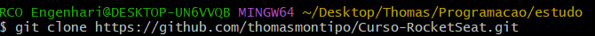

## Principais comandos do Git Hub
Serão apresentados os seguintes conceitos:<br>
1. Criando reposositórios;
2. Comandos no git bash
3. Boas práticas
4. Enviando arquivos para o github


## Mapa 
* Fluxo de importação no github:
    <br>:arrow_right: Criar repositório no GitHub
    <br>:arrow_right: Copiar link do Repositório no GitHub
    <br>:arrow_right: Abrir o Git Bash na pasta
    <br>:arrow_right: **Comando:** "```git clone {colar o link copiado anteriormente}```"
    <br>:arrow_right:```cd {nome da pasta do github}```
    <br>:arrow_right:```git status```
    <br>:arrow_right:```git add .```
    <br>:arrow_right:```git status```
    <br>:arrow_right:```git commit -m "{mensagem que descreva o commit}"```
    <br>:arrow_right:```git checkout -b {nome da nova branch}``` :arrow_right: Apenas na primeira vez;
    <br>:arrow_right:```git push origin novos-arquivos```


## Criando repositórios
Basta entrar no github e clicar em "Create Repository". Após, copiar o link no "Code" e abrir a pasta no seu explorar do windows onde quer que a pasta dos arquivos fique:
- Abrir o cmd ou o git bash na pasta onde você quer clonar a pasta;
- ```git clone {colar o link copiado anteriormente}```
    - O cmd vai criar a pasta do github já mapeada dentro de onde você estava<br>
<br><br><br>

- O terminal fica na pasta (main/master), você deve acessar a pasta que você acabou de clonar:
    - ```cd {nome da pasta do github}```<br>
    <br><br><br>

- caso queira abrir essa pasta no VS Code com o Bash basta fazer o seguinte comando:
    - code .

- Para listar, acessar ou voltar para a pasta anterior digite no terminar, respectivamente, "```ls```", "```cd```" e "```cd ..```":<br>
    <br><br><br>

**Atualizar o repositório remoto com os da pasta local**
- Deve estar na pasta com mesmo nome do repositório (main / master)
- Digitar o comando "```git status```". Esse comando te mostra quais arquivos estão local rastreados pelo github (Untracked files)<br>
<br><br><br>

**Inserindo os arquivos na fila para commit**
- Comando: ```git add .```
    - Git :arrow_right: Comandos do git
    - add :arrow_right: adicione
    - . :arrow_right: todos os arquivos<br>
- Rastreia todos os arquivos e os coloca na fila para commitar (tracked files)
<br><br><br>

**Verificando quais arquivos estão prontos para commitar**
- Comando: ```git status```
- Novamente fazemos "```git status```" para que possamos visualizar quais arquivos estão rastrados para commitar
<br><br><br>

**Enviando os arquivos para o GitHub**
- Comando: ```git commit -m "{mensagem que descreva o commit}"```<br>
<br><br><br>
    
## Boas práticas
- Todas as vezes que você realizar um commit, coloque os arquivos em uma nova branch:
- Comando: ```git checkout -b {nome da nova branch}```<br>
<br><br><br>
- O "```-b```" é para criar uma nova branch e pegar os arquivos que estão commitados, levando-os para lá.
- É possível visualizar que a o nome azul mudou (exatamente por que trocamos de branch)

## Enviando os arquivos para o github
- Comando: ```git push origin novos-arquivos```<br>
<br><br><br>
- "counting objets: 100% (4/4), done."
    - Isso significa que todos os arquivos foram enviados para o github corretamente.